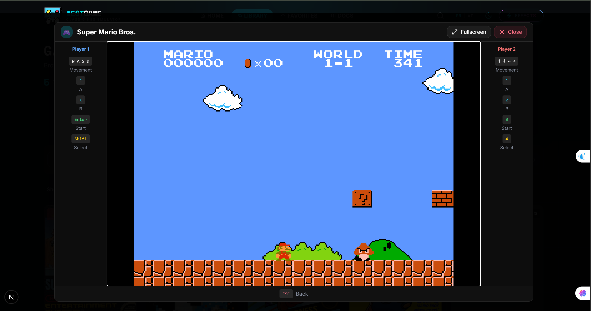
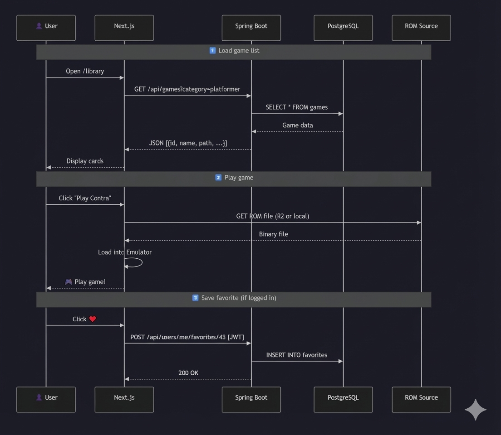

# 🎮 NestGame - Modern NES Game Library


> **Online NES Emulator Platform** - Play 1700+ classic games directly in your browser, completely free!

[](https://nextjs.org/)
[](https://spring.io/projects/spring-boot)
[](https://www.postgresql.org/)
[](https://www.typescriptlang.org/)

---

## ✨ Features

| Feature | Description |
|---------|-------------|
| 🎮 **1700+ Games** | Complete library of classic NES games |
| 🌐 **Play Online** | No installation required, play directly in browser |
| 👥 **2 Players** | Support for 2 players simultaneously |
| 🔐 **User Auth** | Save progress, favorites, play history |
| 🌙 **Dark/Light Mode** | Customizable theme |
| 🌍 **Multi-language** | Vietnamese, English |
| 📱 **Responsive** | Optimized for desktop |

---

## 📸 Screenshots

### Home Page


### Game Library


### Gameplay


### Mobile View


---

## 🏗️ System Architecture


---

## 🔄 System Workflow



---

## 📁 Project Structure

```
NestGame/
├── frontend/          # Next.js 16 + React 19
│   ├── src/
│   │   ├── app/       # App Router pages
│   │   ├── components/# UI Components
│   │   ├── services/  # API services
│   │   └── contexts/  # React contexts
│   └── public/        # Static assets
│
├── backend/           # Spring Boot 3.2
│   └── src/main/java/com/nestgame/
│       ├── controller/# REST Controllers
│       ├── service/   # Business logic
│       ├── repository/# JPA Repositories
│       ├── entity/    # Database entities
│       └── dto/       # Data Transfer Objects
│
└── database/          # PostgreSQL Schema
    ├── schema.sql     # Tables definition
    └── sample_data.sql# Sample data
```

---

## 🎨 Design Patterns

### Backend (Spring Boot)

| Pattern | Implementation | Purpose |
|---------|---------------|---------|
| **MVC** | Controller → Service → Repository | Separation of concerns |
| **Repository** | `GameRepository`, `UserRepository` | Data access abstraction |
| **DTO** | `GameDTO`, `UserDTO`, `AuthResponse` | Decouple entities from API |
| **Service Layer** | `GameService`, `AuthService` | Business logic encapsulation |
| **Dependency Injection** | `@Autowired`, Constructor injection | Loose coupling |
| **Filter Chain** | `JwtAuthenticationFilter`, `RateLimitingFilter` | Request processing pipeline |
| **Builder** | `JwtBuilder`, DTO builders | Object construction |
| **Singleton** | Spring Beans (`@Service`, `@Component`) | Single instance management |

### Frontend (Next.js)

| Pattern | Implementation | Purpose |
|---------|---------------|---------|
| **Component-Based** | React components | Reusable UI elements |
| **Provider** | `AuthContext`, `ThemeProvider` | Global state management |
| **Custom Hooks** | `useAuth`, `useGames` | Logic reusability |
| **Container/Presenter** | Page + Components | Separation of logic and UI |

---

## 🛠️ Tech Stack


### Frontend
- **Next.js 16** - React framework with App Router
- **React 19** - UI library
- **TailwindCSS** - Styling
- **Zustand** - State management
- **React Query** - Server state
- **Nostalgist** - NES Emulator

### Backend
- **Spring Boot 3.2** - Java framework
- **Spring Security** - Authentication
- **JWT** - Token-based auth
- **PostgreSQL** - Database
- **JPA/Hibernate** - ORM

---

## 🚀 Installation

### Requirements
- Node.js >= 20.9.0
- Java 17+
- PostgreSQL 16
- Maven 3.9+

### 1️⃣ Clone Repository

```bash
git clone https://github.com/daiphu1801/NestGame.git
cd NestGame
```

### 2️⃣ Database Setup

```bash
# Create PostgreSQL database
psql -U postgres -c "CREATE DATABASE NestGameDB;"

# Import schema
psql -U postgres -d NestGameDB -f database/schema.sql

# Import sample data (optional)
psql -U postgres -d NestGameDB -f database/sample_data.sql
```

### 3️⃣ Backend (Spring Boot)

```bash
cd backend

# Configure database
# Open src/main/resources/application.yml and update:
# - DB_PASSWORD: your PostgreSQL password
# - JWT_SECRET: secret key for JWT

# Run backend
mvn spring-boot:run
```

Backend runs at: `http://localhost:8080/api`

### 4️⃣ Frontend (Next.js)

```bash
cd frontend

# Install dependencies
npm install

# Run development server
npm run dev
```

Frontend runs at: `http://localhost:3000`

---

## 🎮 Controls

### Player 1
| Key | Action |
|-----|--------|
| `W A S D` | Movement |
| `J` | Button A |
| `K` | Button B |
| `Enter` | Start |
| `Shift` | Select |

### Player 2
| Key | Action |
|-----|--------|
| `↑ ↓ ← →` | Movement |
| `1` | Button A |
| `2` | Button B |
| `3` | Start |
| `4` | Select |

---

## 📡 API Endpoints

### Games
| Method | Endpoint | Description |
|--------|----------|-------------|
| GET | `/api/games` | Get all games |
| GET | `/api/games/{id}` | Get game details |
| GET | `/api/games?category=&search=` | Search & filter |

### Authentication
| Method | Endpoint | Description |
|--------|----------|-------------|
| POST | `/api/auth/login` | Login |
| POST | `/api/auth/register` | Register |
| POST | `/api/auth/refresh` | Refresh token |
| POST | `/api/auth/forgot-password` | Forgot password |

### User
| Method | Endpoint | Description |
|--------|----------|-------------|
| GET | `/api/users/me` | Get user info |
| PUT | `/api/users/me` | Update profile |
| GET | `/api/users/me/favorites` | Get favorites |
| POST | `/api/users/me/favorites/{gameId}` | Add favorite |

---

## 🔒 Security

- ✅ **Path Traversal Protection** - Prevents unauthorized file access
- ✅ **Rate Limiting** - 100 requests/minute/IP
- ✅ **Security Headers** - XSS, Clickjacking protection
- ✅ **JWT Authentication** - Token-based auth
- ✅ **Password Hashing** - BCrypt encryption
- ✅ **CORS Configuration** - Cross-origin protection

---

## 🌐 Demo

- **Live Demo**: [Coming Soon]
- **API Docs**: `http://localhost:8080/api/swagger-ui.html`

---

## 👨‍💻 Author

**Bui Dai Phu** - [@daiphu1801](https://github.com/daiphu1801)

- 🎓 Student at Hanoi University of Civil Engineering
- 💼 Java Spring Boot | Web Development | Blockchain

---

## 📄 License

This project is for educational purposes only. Not for commercial use.

---

<p align="center">
  Made with ❤️ in Vietnam 🇻🇳
</p>
