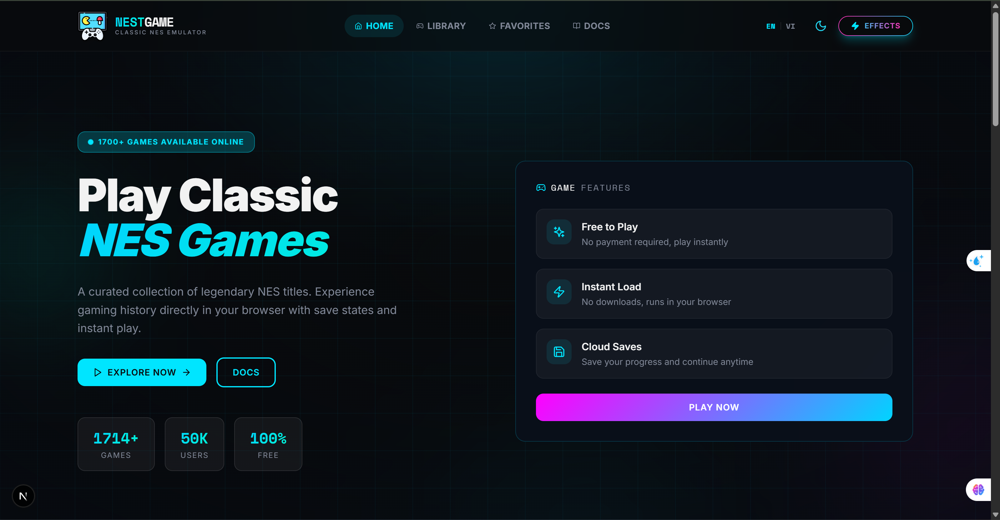
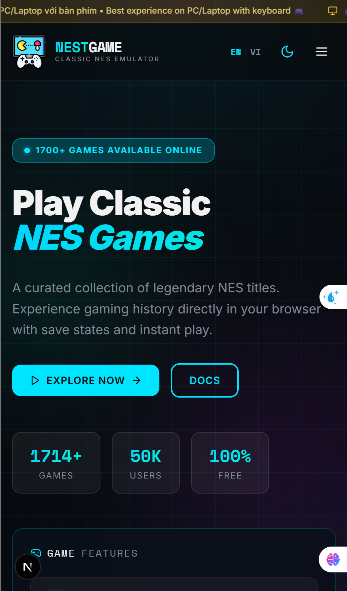

# NestGame Library 🎮

A modern NES game library - Play classic retro games directly in your browser with a stunning interface.

> **Designed & Developed by [@daiphu1801](https://github.com/daiphu1801)**

## 📸 Preview






## 🛠️ Tech Stack

| Technology | Description |
|------------|-------------|
| [Next.js 16](https://nextjs.org/) | React Framework with App Router |
| [TypeScript](https://www.typescriptlang.org/) | Type-safe JavaScript |
| [Tailwind CSS](https://tailwindcss.com/) | Utility-first CSS Framework |
| [Zustand](https://github.com/pmndrs/zustand) | Lightweight State Management |
| [Lucide React](https://lucide.dev/) | Beautiful Icon Library |
| [Nostalgist.js](https://nostalgist.js.org/) | NES Emulation Core |

## 📁 Project Structure

```
src/
├── app/                    # Next.js App Router
│   ├── page.tsx           # Homepage
│   ├── library/           # Game library page
│   ├── favorites/         # Hot games page
│   ├── docs/              # Documentation page
│   └── globals.css        # Global styles
├── components/
│   ├── layout/            # Header, Footer
│   ├── game/              # GameCard, GameGrid, GameModal
│   ├── search/            # CategoryFilter, FilterToolbar
│   ├── ui/                # shadcn/ui components
│   └── providers/         # Theme, Language, Performance
├── features/games/        # Game store (Zustand)
├── services/              # gameService, imageService
├── i18n/                  # Internationalization (vi, en)
└── types/                 # TypeScript interfaces
```

## ✨ Features

- 🕹️ **NES Emulator** - Play games directly in browser
- 🎨 **Modern UI/UX** - Glassmorphism, Dark/Light mode
- 🔍 **Smart Search** - Filter by category, region
- 💾 **Save Progress** - Local storage support
- 🌍 **Multi-language** - Vietnamese, English
- ⚡ **Performance Mode** - Optimized for low-end devices
- 📱 **Responsive** - Desktop, tablet, mobile

## 🚀 Getting Started

```bash
# Clone the repository
git clone https://github.com/daiphu1801/NestGameNextLibrary.git

# Install dependencies
npm install

# Run development server
npm run dev

# Build for production
npm run build
```

Open [http://localhost:3000](http://localhost:3000) to view the app.

## 👤 Author

**Đại Phú (daiphu1801)**

- GitHub: [@daiphu1801](https://github.com/daiphu1801)
- Design, Development & Idea by daiphu1801

## 📄 License

MIT License

---

*This project uses an emulator frontend. Users must provide their own game ROMs.*
